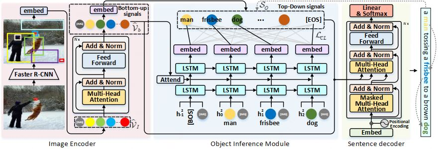

# Introduction
This repository is for **Bottom-up and Top-down Object Inference Networks for Image Captioning**

<p align="center">
  
</p>


## Requirements
* Python 3
* CUDA 10
* numpy
* tqdm
* easydict
* [PyTorch](http://pytorch.org/) (>1.0)
* [torchvision](http://pytorch.org/)
* [coco-caption](https://github.com/ruotianluo/coco-caption)

## Data preparation
1. Download the [bottom up features](https://github.com/peteanderson80/bottom-up-attention) and convert them to npz files
```
python3 tools/create_feats.py --infeats bottom_up_tsv --outfolder ./mscoco/feature/up_down_10_100
```

2. Download the [annotations](https://drive.google.com/open?id=1i5YJRSZtpov0nOtRyfM0OS1n0tPCGiCS) into the mscoco folder. More details about data preparation can be referred to [self-critical.pytorch](https://github.com/ruotianluo/self-critical.pytorch)

3. Download [coco-caption](https://github.com/ruotianluo/coco-caption) and setup the path of __C.INFERENCE.COCO_PATH in lib/config.py

## Training
### Train BTO-Net model
```
bash experiments/btonet/train.sh
```

## Evaluation
```
CUDA_VISIBLE_DEVICES=0 python3 main_test.py --folder experiments/btonet --resume model_epoch
```

## Acknowledgements
Thanks the contribution of [self-critical.pytorch](https://github.com/ruotianluo/self-critical.pytorch) and awesome PyTorch team.
